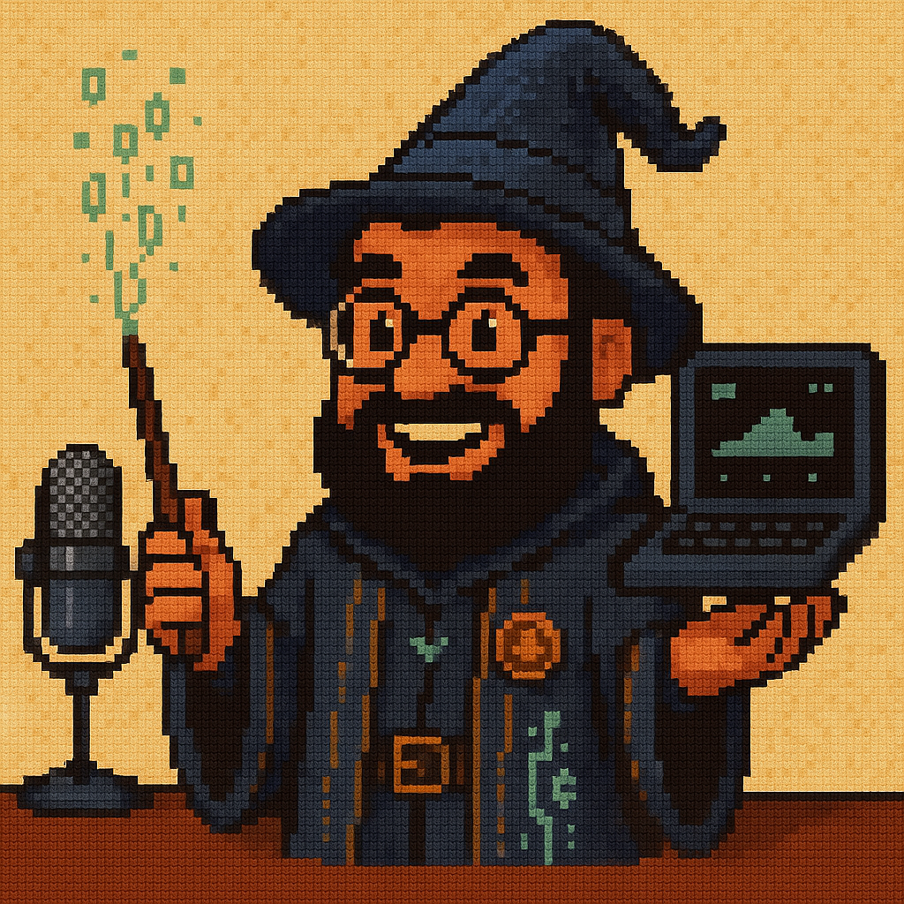

<h1><strong>Debugwarts Podcast</strong></h1>

<h2><strong>Descrição</strong></h2>
<p align="justify">
  Este projeto consiste na criação completa de um podcast sobre desenvolvimento de jogos retrô com estética mágica e temática inspirada em Hogwarts.
  Todo o processo desde a ideação do nome, roteirização do primeiro episódio, criação do personagem mascote, até a produção de áudio e edição final foi realizado utilizando ferramentas de IA generativa.
  O objetivo foi aplicar os fundamentos aprendidos no curso de IA Generativa para construir um produto criativo, coeso e profissional do zero.
</p>

<h2><strong>Tecnologias Utilizadas</strong></h2>
<ul>
  <li align="justify"><a href="https://chatgpt.com/"><strong>ChatGPT</strong></a>: Criação do nome, roteiro e estrutura do podcast.</li>
  <li align="justify"><a href="https://www.midjourney.com/"><strong>Midjourney</strong></a>: Criação do personagem mascote e identidade visual.</li>
  <li align="justify"><a href="https://elevenlabs.io/"><strong>ElevenLabs</strong></a>: Conversão do roteiro em áudio com voz gerada por IA.</li>
  <li align="justify"><a href="https://www.capcut.com/"><strong>CapCut</strong></a>: Edição do episódio, mixagem e inserção de trilhas sonoras.</li>
</ul>

<h2><strong>Demonstração do Projeto</strong></h2>

<br/>
<a href="https://github.com/williandpg/debugwarts-podcast"><strong>Ouça o podcast aqui</strong></a>

<h2><strong>Estrutura do Projeto</strong></h2>
<p align="justify">A estrutura do projeto é organizada da seguinte forma:</p>

```plaintext
/
├── assets/
│   └── image-podcast.png
├── output/
│   ├── edited-audio.mp3
│   └── synthesized-audio.mp3
├── src/
│   └── prompts/
│      ├── chatgpt-name.md
│      ├── chatgpt-roadmap.md
│      └── midjourney-image.md
└── README.md
```

<h2><strong>Notas</strong></h2>
<ul>
  <li align="justify">Criei o nome e roteiro do podcast utilizando IA generativa (ChatGPT).</li>
  <li align="justify">Desenvolvi a identidade visual do mascote com Midjourney.</li>
  <li align="justify">Produzi o áudio do episódio com voz gerada por IA no ElevenLabs.</li>
  <li align="justify">Editei e finalizei o episódio no CapCut, aplicando trilhas e cortes.</li>
</ul>

<h2><strong>Contato</strong></h2>
<p><strong>Willian Gonçalves</strong> | 
    <a href="https://www.linkedin.com/in/williandpg/" target="_blank"><strong>LinkedIn</strong></a> | 
    <a href="https://github.com/williandpg" target="_blank"><strong>Github</strong></a> | 
    <a href="https://williandpg.github.io/" target="_blank"><strong>Portfólio</strong></a> | 
    <a href="mailto:goncalves.wdp@outlook.com" target="_blank"><strong>Email</strong></a>
</p>

<h2><strong>Créditos</strong></h2>
<p align="justify">Este projeto foi desenvolvido como parte do curso de Fundamentos de IA Generativa oferecido pela DIO.</p>

<details>
  <summary>**English Version**</summary>

  <h1><strong>Debugwarts Podcast</strong></h1>

  <h2><strong>Descrição</strong></h2>
  <p align="justify">
    This project consists of the complete creation of a podcast about retro game development with a magical aesthetic inspired by Hogwarts.
    The entire process from naming, writing the first episode, creating the mascot, to producing the audio and editing was done using Generative AI tools.
    The goal was to apply the knowledge learned in the Generative AI course to build a cohesive and creative product from scratch.
  </p>

  <h2><strong>Technologies Used</strong></h2>
  <ul>
    <li align="justify"><a href="https://chatgpt.com/"><strong>ChatGPT</strong></a>: Podcast name and script generation.</li>
    <li align="justify"><a href="https://www.midjourney.com/"><strong>Midjourney</strong></a>: Visual mascot creation.</li>
    <li align="justify"><a href="https://elevenlabs.io/"><strong>ElevenLabs</strong></a>: AI voice generation.</li>
    <li align="justify"><a href="https://www.capcut.com/"><strong>CapCut</strong></a>: Episode editing and sound mixing.</li>
  </ul>

  <h2><strong>Project Demonstration</strong></h2>
  
  <br/>
  <a href="https://github.com/williandpg/debugwarts-podcast"><strong>Listen to the podcast here</strong></a>

  <h2><strong>Project Structure</strong></h2>
  <p align="justify">The project structure is organized as follows:</p>

  ```plaintext
  /
  ├── assets/
  │   └── image-podcast.png
  ├── output/
  │   ├── edited-audio.mp3
  │   └── synthesized-audio.mp3
  ├── src/
  │   └── prompts/
  │      ├── chatgpt-name.md
  │      ├── chatgpt-roadmap.md
  │      └── midjourney-image.md
  └── README.md
  ```

  <h2><strong>Notes</strong></h2>
  <ul>
    <li align="justify">Created the podcast name and script using generative AI (ChatGPT).</li>
    <li align="justify">Developed the mascot’s visual identity with Midjourney.</li>
    <li align="justify">Produced the episode’s audio using AI-generated voice in ElevenLabs.</li>
    <li align="justify">Edited and finalized the episode in CapCut, adding music and cuts.</li>
  </ul>

  <h2><strong>Contact</strong></h2>
  <p><strong>Willian Gonçalves</strong> | 
    <a href="https://www.linkedin.com/in/williandpg/" target="_blank"><strong>LinkedIn</strong></a> | 
    <a href="https://github.com/williandpg" target="_blank"><strong>GitHub</strong></a> | 
    <a href="https://williandpg.github.io/" target="_blank"><strong>Portfolio</strong></a> | 
    <a href="mailto:goncalves.wdp@outlook.com" target="_blank"><strong>Email</strong></a>
  </p>

  <h2><strong>Credits</strong></h2>
  <p align="justify">This project was developed as part of the Generative AI Fundamentals course by DIO.</p>
</details>
